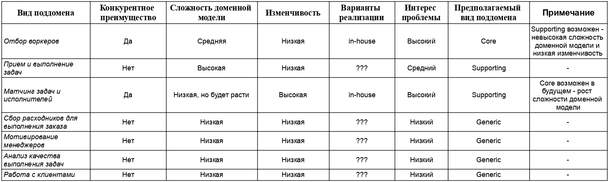
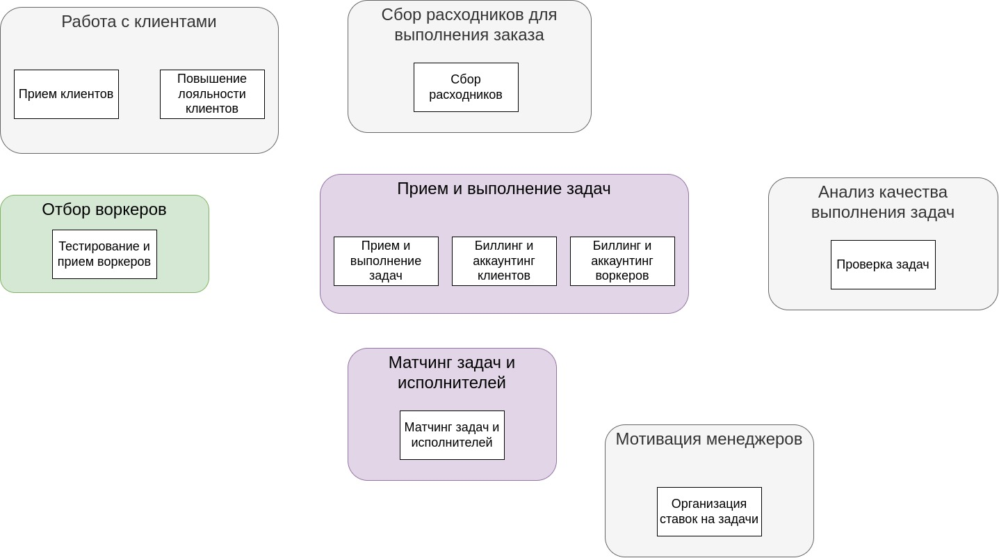
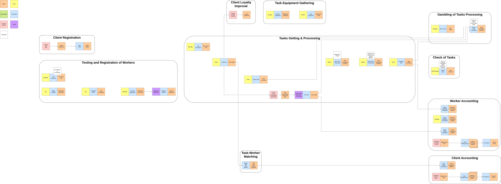
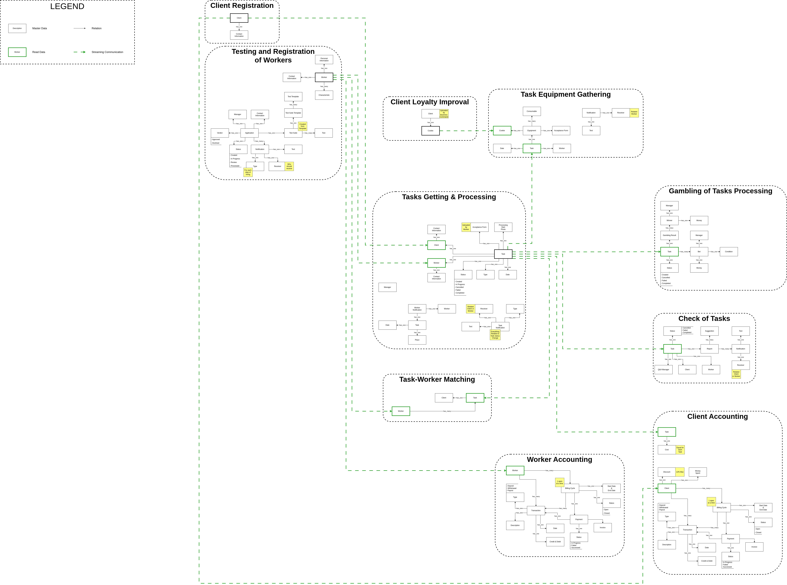

# Assignment 2

## Sub Domains

Проблема - повышение производительности работников / выполнение рутинных задач котов

Поддомены:

1. Отбор воркеров

Исходя из требований бизнес считает отбор воркеров важной проблемой, для которой разработано специфичное решение, оказывающее весомое влияение на идею бизнеса. Решение проблемы будет являться конкурентным преимуществом.

2. Прием и выполнение задач

Проблема, которая соответствует главной цели бизнеса - повышение производительности работников, путем выполнения их рутинных задач.

3. Матчинг задач и исполнителей

Исходя из требований решение проблемы будет являться конкурентным преимуществом, поэтому это предлагается рассмотреть как отдельную проблему, а не часть "Приема и выполнения задач".

4. Сбор расходников для выполнения заказа

Для этой проблемы выделен отдел исходя из требований (US-130).

5. Мотивирование менеджеров

В требованиях отдельно выделена проблема мотивации менеджеров (US-250).

6. Анализ качества выполнения задач

В требованиях указано, что анализом качества будет заниматься отдел по изучению качества работы (US-170).

7. Работа с клиентами

Для бизнеса кроме воркеров также требуются клиенты, которые будут создавать задачи и приносить прибыль. Также исходя из требований (US-150) компания делает шаги в сторону повышения лояльности клиентов, что также составляет проблему по работе с клиентами.

## SubDomains Types & Core Domain Chart

Для определения типов использовалась таблица из урока.

Core Domain Chart:

## Bounded Contexts

Различия с ES из 1-го урока:

- Billing & Accounting:
  - Выделены отдельные контексты для клиента и воркера по сравнению с ES
  - На ES выделены отдельные цепочки для Client & Worker, но объединены в один контекст, т.к. идея была в разделении на сервисы и логично делать работу по финансам внутри одного сервиса
- Выделен отдельный контекст для матчинга задач и исполнителей:
  - Поначалу в ES также выделил это в отдельный контекст, после разбора убрал, т.к. выглядело, что это технический шаг
- Появился дополнительный контекст - "Повышение лояльности клиентов":
  - В ES не отображал действие по заказу печенек, т.к. выглядело как деталь процесса подготовки расходников для воркера
- Названия адаптировались в более бизнесовое русло:
  - `Orders` -> `Getting and Processing of Tasks`
  - `Worker Hiring` -> `Worker Testing & Registration`
  - `Order Quality Assurance` -> `Quality Check of Tasks`
  - `Equipment for Order` -> `Equipment Gathering`
  - Названия теперь отталкиваются от проблематики, а не от решений

## EventStroming & Data Model

## Characteristics
